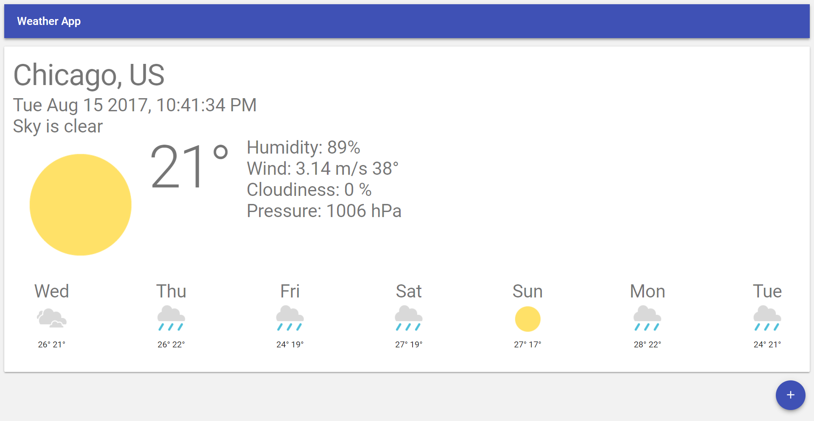

This project was bootstrapped with [Create React App](https://github.com/facebookincubator/create-react-app).

# Material Weather App
> Weather Web app of Chicago city.



# Requirements
 - NodeJS v8.3.0
 - npm 5.3.0

## Install

```
> npm install
```

## Build
```
> npm start
```

Runs the app in the development mode.<br>
Open [http://localhost:3000](http://localhost:3000) to view it in the browser.

The page will reload if you make edits.<br>
You will also see any lint errors in the console.

## Built With

* [React](https://facebook.github.io/react/) - Javascript library for building user interfaces
* [material-ui](https://material-ui-1dab0.firebaseapp.com/) - A React component library implementing Google's Material Design
* [OpenWeatherMap](https://openweathermap.org/) - Weather API used 

## Acknowledgments

* Inspiration (https://weather-pwa-sample.firebaseapp.com/step-05/)


## Licence
MIT &copy; martinruiz
